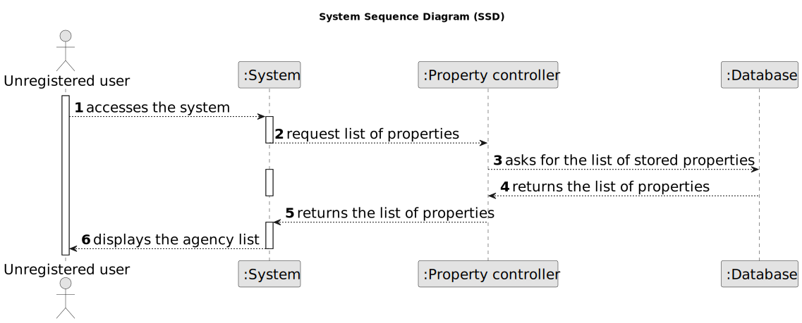

# US 001 - To display listed properties (unregistered user) 

## 1. Requirements Engineering

### 1.1. User Story Description

As an unregistered user, I want to display listed properties.

### 1.2. Customer Specifications and Clarifications 

**From the specifications document:**

>	The possible owner can browse available properties in a specific area and get an idea of the market 

>	The goal is to find something that meets his needs and budget, and then persuade him to register for an account to start the process of buying or renting it 

**From the client clarifications:**

> **Question:** Does the unregistered user need to login or register to see the list of properties?
>  
> **Answer:** No, the unregistered user does not need to login or register to see the agency list.

> **Question:** What specific information about the properties will the unregistered user be able to see in the list?
>  
> **Answer:** This will depend on what has been defined as basic agency information. This information includes the agency type, number of rooms, price, location and a photo. The unregistered user may not have access to more detailed information, such as full descriptions, additional features or seller contact information.

> **Question:** Will there be any information about the availability of properties on the list?
> 
> **Answer:** Normally, the availability of properties is updated in real time, but it may be that the information is not available in the list. The unregistered user may need to click on a specific agency to check its updated availability.

### 1.3. Acceptance Criteria

* **AC1:** The user should be able to filter the listing results by location, price, size, agency type and other relevant criteria.
* **AC2:** He´s also able to save his favorite properties and compare them with others he has seen
* **AC3:** The properties must be displayed in a clear and organized way, facilitating the reading and identification of the main details of each agency.

### 1.4. Found out Dependencies

* There is a dependency to "US003 Create a task category" since at least a task category must exist to classify the task being created.

### 1.5 Input and Output Data

**Input Data:**

* Typed data:
	* A search bar so the user can search for specific properties by name, address or other relevant information.
	
* Selected data:
	* Sorting options (e.g. price, location, size)
    * Filtering options (e.g. price range, location, number of bedrooms)

**Output Data:**

* A list of properties is displayed

### 1.6. System Sequence Diagram (SSD)

### 1.7 Other Relevant Remarks

* Information on listed properties is guaranteed to be accurate and up to date, so users can make informed decisions when considering a agency.
* The security of users and their personal information, including contact details and payment information, is guaranteed if the platform allows booking properties.