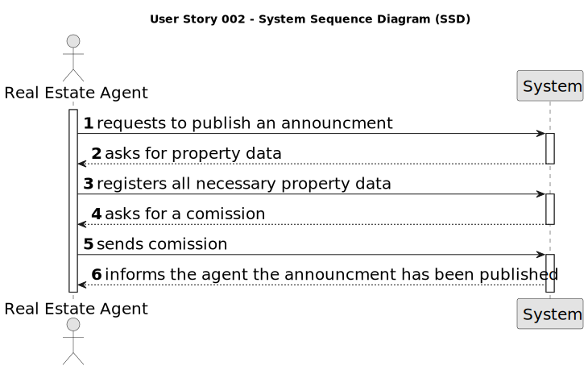

# US 002 - To publish an announcement 

## 1. Requirements Engineering

### 1.1. User Story Description

As an agent, I can publish any sale announcement on the system, for example received through a phone call.

### 1.2. Customer Specifications and Clarifications 

**From the specifications document:**

>The real estate agent publishes announcements of the owner's  properties.

> As soon as the clients are interested on these properties, the agent schedules a meeting with the future possibility of getting a sale or agency rent.

** From the client clarifications:**  

> **Question:** How does the agent determine whether it is a fixed commission or a percentage commission? 
>
> **Answer:** The agent should choose the type of commission and enter the value.

> **Question:** Is the phone call the only way the agent can receive the sale announcement? Or he can receive them via e-mail/letter/etc
>
> **Answer:** For now this is the only way.

> **Question:** Can an Agent work in more than 1 store (Multiple stores)? 
>
> **Answer:** No.

> **Question:** According to the Project Description, the agent when selling a agency can charge a flat price comission or a percentage of the sale value, my question here is wether there is a minimum and/or a maximum to each of these types of comissions?
> 
> **Answer:** There is no maximum and the minimum is 0.

### 1.3. Acceptance Criteria 

Acceptencre criterias were not mentioned on this user story description.

### 1.4. Found out Dependencies 

* There is a dependency on US004 in which the owner submits a request for a agency sale or rent, choosing the responsible agent .
The owner submits the company agency data to the agent through a phone call , without the agency data the USS02 can't proceed because the agent can't publish any announcement.

### 1.5 Input and Output Data

**Input Data:**

- Id/email
- Password

*After login*
- Selection of the land 
- Announcment descrition
- Comission

**Output Data:**
* Announcment display
* Announcment Statement display (publhsed/not published)

### 1.6. System Sequence Diagram (SSD)

### 1.7 Other Relevant Remarks

* It is important to know that a person can play different roles on these user stories ,a client and a store manager can also be agents for example.