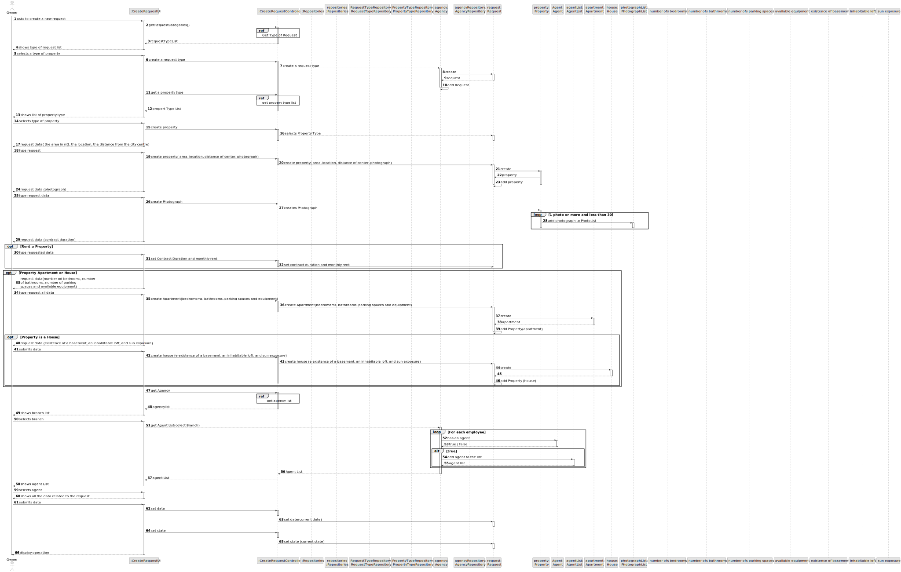
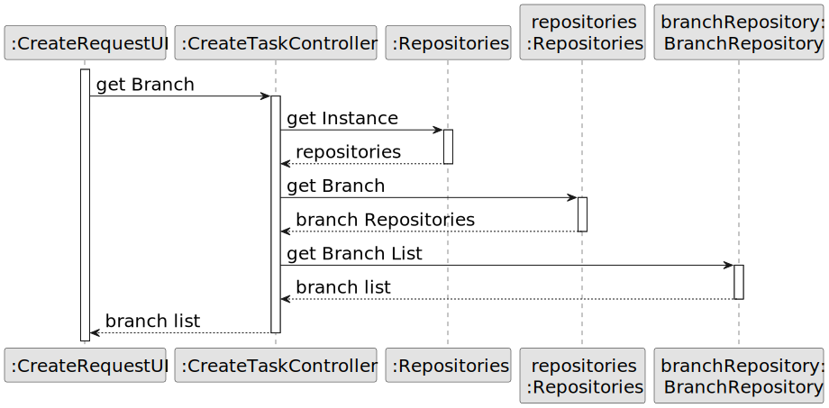

# US 004 - Submit a request

## 3. Design - User Story Realization 

### 3.1. Rationale

**SSD - Alternative 1 is adopted.**

| Interaction ID                         | Question: Which class is responsible for...       | Answer                  | Justification (with patterns)                                                                                 |
|:---------------------------------------|:--------------------------------------------------|:------------------------|:--------------------------------------------------------------------------------------------------------------|
| Step 1  ask to create a new request		  | 	... interacting with the actor?                  | CreateRequestUI         | Pure Fabrication: there is no reason to assign this responsibility to any existing class in the Domain Model. |
| 			  		                                | 	... coordinating the US?                         | CreateRequestController | Controller                                                                                                    |
| 	Step 2	shows the requests type? 	  		 | 	  display the type of  request list ?            | CreateRequestUi         | Pure Fabrication                                                                                              ||
| 			  		                                | 							                                           | Agency                  | IE: knows/has its own Agents                                                                                  |
| 			  		                                | 							                                           | Agent                   | IE: knows its own data (e.g. email)                                                                           |
|                                        | ... creating a request?                           | Owner                   | IE: knows the house information                                                                               |
| Step 3  	shows type of property        | 					...creating a request for type of property?	 | Agency                  | Agency has a list of Request                                                                                  |
|                                        | ...shows the type of property?	                   | Property                | has the list of type of property                                                                              |                                                                                        |                         |                                                                                                               |
| Step 4 		Photos                        | 	...creating the photography list?                | CreateRequestUI         | Pure fabrication                                                                                              |
|                                        | ...creating the property?                         | Request                 | Request has a property                                                                                        |
| Step 5  	requests data	                | 	...displaying the UI for the user to input data? | CreateRequestUI         | Pure Fabrication                                                                                              |
| Step 6  		  type requested data        | 	... saving temporarily the inputted data?        | CreateRequestUI         | Pure Fabrication                                                                                              |
| Step 7  		show  agencies list          | 			...display the list of agencies	?			           | CreateRequestUI         | Pure Fabrication                                                                                              |              
| Step 8      select the agency          | ...obtaining the request agency list?             | Request                 | has the agencies list                                                                                         |
| Step 9 show  agents list               | ...display the list of agents	?                   | CreateRequestUI         | Pure Fabrication                                                                                              |
| Step 10               selects agent    | ...obtaining the request agent list?              | Request                 | has the agents list                                                                                           |
| Step 11  		 sell or rent               | 	... selling or renting a property?               | CreateRequestUI         | Pure Fabrication                                                                                              | 
|                                        |                       ... selling or renting a property                            | Request                 | Request has the option to buy or sell                                                                         |
| Step 12			                             | 	... validating all data (global validation)?     | Organization            | IE: knows all its tasks.                                                                                      | 
| 			  		                                | 	... saving the created task?                     | Organization            | IE: owns all its tasks.                                                                                       | 
| Step 13  		                            | 	... informing operation success?                 | CreateTaskUI            | IE: is responsible for user interactions.                                                                     | 

### Systematization ##

According to the taken rationale, the conceptual classes promoted to software classes are: 

 * Organization
 * Task

Other software classes (i.e. Pure Fabrication) identified: 

 * CreateTaskUI  
 * CreateTaskController

## 3.2. Sequence Diagram (SD)

### Alternative 1 - Full Diagram

This diagram shows the full sequence of interactions between the classes involved in the realization of this user story.

### Alternative 2 - Split Diagram

This diagram shows the same sequence of interactions between the classes involved in the realization of this user story, but it is split in partial diagrams to better illustrate the interactions between the classes.

It uses interaction ocurrence.

**Request Type List**

**Get Agency**

**Get Property Type**

## 3.3. Class Diagram (CD)

