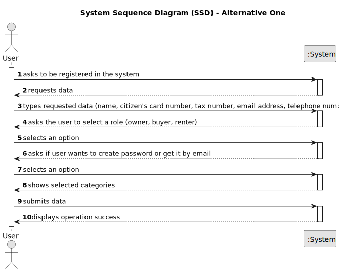

# US 007 - To register a new user in the system 

## 1. Requirements Engineering

### 1.1. User Story Description

As an unregistered user, I want to register in the system to buy, sell or rent properties

### 1.2. Customer Specifications and Clarifications 

**From the specifications document:**

> All those who wish to use the application must be authenticated with a password of seven alphanumeric characters, including three capital letters and two digits

**From the client clarifications:**

> **Question:** Does the user also receive the password via email or can he choose a password when registering?
>
> **Answer:** The owner can choose a password when registering.

> **Question:** When an unregistered user wants to register a new account in the system, the set of parameters that are asked are the following: name, citizen card number, tax number, email, phone number, and password. Do you want any extra parameters/requirements to be asked or just the ones specified above? If so, which ones are mandatory?
>
> **Answer:** The Owner attributes are: the name, the citizen's card number, the tax number, the address, the email address and the contact telephone number. The address of the owner is not mandatory.

> **Question:** It was previously stated that an unregistered user could do a property listing request. However, with the introduction of US007, I want to clarify and make sure that now a user needs to be registered in order to buy, sell or rent properties, or if they can still do it unregistered.
>
> **Answer:** In Sprint B we introduce US7 and now, in US4, the owner needs to be registered in the system to submit a request for listing. You should update all artifacts to include this change.

> **Question:** You said that the owner can choose a password, but how many letters, numbers... it needs to have?
>
> **Answer:** In the Project Description we get: "All those who wish to use the application must be authenticated with a password of seven alphanumeric characters, including three capital letters and two digits". Please read the documentation and clarifications made by the client.

> **Question:** When a user registers in the system, does it need to specify for which transactional activities or all registered users can buy sell and rent?
>
> **Answer:** All registered users can buy sell and rent.

> **Question:** After the users fills all the required information, is the user automatically registered in the system, or is there any other role that will review and approve the user registration?
>
> **Answer:** The system should automatically validate the registration.

> **Question:** When a user starts a registration, does the application need to validate if the data is valid (for example: blank text box, email without @, etc)?
>
> **Answer:** Data validation is always a good practice.

### 1.3. Acceptance Criteria

* **AC1:** All required fields must be filled in.
* **AC2:** password of seven alphanumeric characters, including three capital letters and two digits.
* **AC3:** Required data: the name, the citizen's card number, the tax number, the email address and the contact telephone number.

### 1.4. Found out Dependencies

* There are no dependencies found.

### 1.5 Input and Output Data

**Input Data:**

* Typed data:
	* a name 
	* a citizen card number 
	* a tax number
	* an email address
	* a telephone number

	
* Selected data:
  * Category of the role of the user
  * Option to create a password or get it via email

**Output Data:**

* (In)Success of the operation

### 1.6. System Sequence Diagram (SSD)

**Other alternatives might exist.**

#### Alternative One

### 1.7 Other Relevant Remarks

* The user can either choose to get their password created by the system and delievered via email or create it themselves.