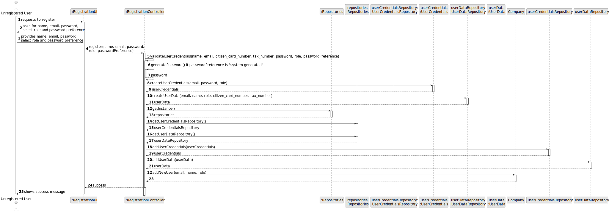

# US 007 - To register a new user in the system

## 3. Design - User Story Realization 

### 3.1. Rationale

**SSD - Alternative 1 is adopted.**

| Interaction ID | Question: Which class is responsible for...   | Answer                    | Justification (with patterns)                                                                                 |
|:---------------|:----------------------------------------------|:--------------------------|:--------------------------------------------------------------------------------------------------------------|
| Step 1  		     | 	... interacting with the actor?              | RegistrationUI            | Pure Fabrication: there is no reason to assign this responsibility to any existing class in the Domain Model. |
| 			  		        | 	... coordinating the US?                     | RegistrationkController   | Controller                                                                                                    |
| 			  		        | 	... instantiating a new USer?                | UserCredentialsRepository | Creator (Rule 1): in the UserCredentialsRepository keeps all user credentials.                                |
| 			  		        | 							                                       | Organization              | IE: knows/has its own Employees                                                                               |
| 			  		        | 							                                       | User                      | IE: knows its own data (e.g. email)                                                                           |
| Step 2  		     | 							                                       |                           |                                                                                                               |
| Step 3  		     | 	...saving the inputted data?                 | UserDataRepository        | IE: object created in step 1 has its own data.                                                                |
| Step 4  		     | 	...knowing the role categories to show?      | System                    | IE: Role Categories are defined in the system.                                                                |
| Step 5  		     | 	... saving the selected category?            | RegistrationController    | IE: object created in step 1 is classified in one Category.                                                   |
| Step 6  		     | 							                                       |                           |                                                                                                               |              
| Step 7  		     | 	... validating all data (local validation)?  | User                      | IE: owns its data.                                                                                            | 
| 			  		        | 	... validating all data (global validation)? | RegistrationController    | Controller                                                                                                    | 
| 			  		        | 	... saving the created user?                 | Organization              | IE: owns all its users.                                                                                       | 
| Step 8  		     | 	... informing operation success?             | RegistrationUI            | IE: is responsible for user interactions.                                                                     | 

### Systematization ##

According to the taken rationale, the conceptual classes promoted to software classes are: 

 * Organization
 * Role

Other software classes (i.e. Pure Fabrication) identified: 

 * RegistrationUI  
 * RegistrationController

## 3.2. Sequence Diagram (SD)

### Alternative 1 - Full Diagram

This diagram shows the full sequence of interactions between the classes involved in the realization of this user story.

## 3.3. Class Diagram (CD)

