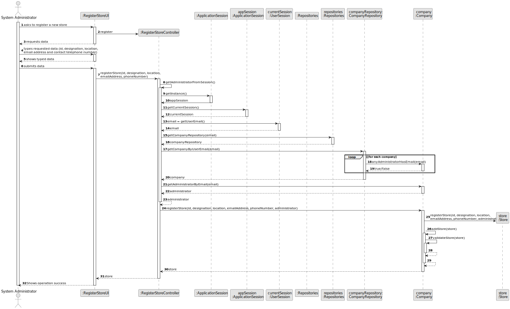
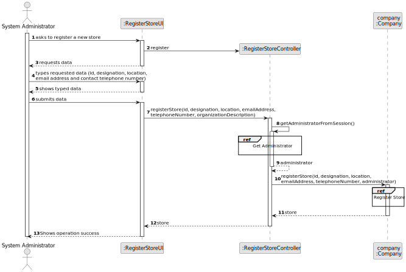
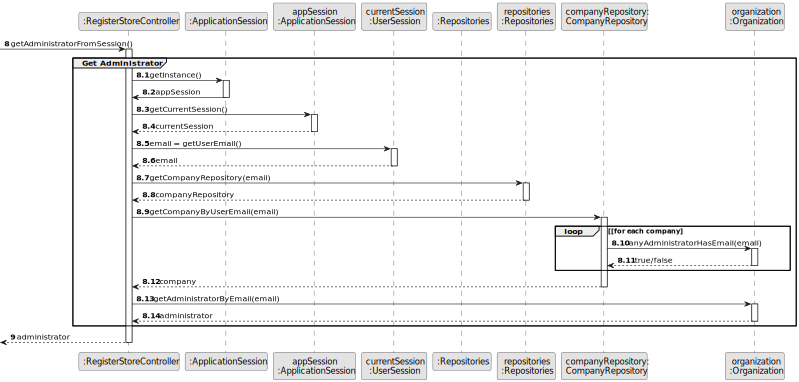
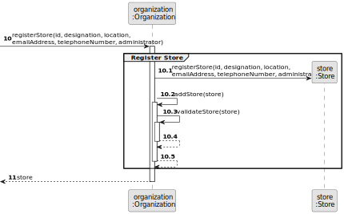
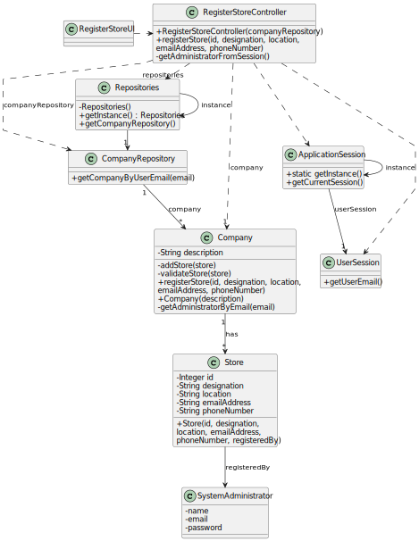

# US 005 - To register a Store

## 3. Design - User Story Realization 

### 3.1. Rationale

| Interaction ID | Question: Which class is responsible for...   | Answer                  | Justification (with patterns) |
|:---------------|:----------------------------------------------|:------------------------|:----------|
| Step 1  		     | 	... interacting with the actor?              | RegisterStoreUI         | Pure Fabrication: there is no reason to assign this responsibility to any existing class in the Domain Model.|
| 			  		        | 	... coordinating the US?                     | RegisterStoreController | Controller|
| 			  		        | 	... instantiating a Store?                   | Company                 | Creator (Rule 1): in the DM, Company has a Store. |
| 			  		        | ... knowing the user using the system?        | UserSession             | IE: cf. A&A component documentation. |
| 			  		        | 							                                       | Company                 | IE: knows/has its own System Administratores |
| 			  		        | 							                                       | SystemAdministrator     | IE: knows its own data (e.g. email) |            
| Step 2  		     | 			                                           |                         |           |
| Step 3         | ...saving the inputted data?                  | Store                   | IE: object created in step 1 has its own data. |
| Step 4         |                                               |                         |           |
| Step 5  		     | 	... validating all data (local validation)?  | Store                   | IE: owns its data. | 
| 			  		        | 	... validating all data (global validation)? | Company                 | IE: knows all stores. | 
| 			  		        | 	... saving the registered store?             | Company                 | IE: owns all stores. | 
| Step 6  		     | 	... informing operation success?             | RegisterStoreUI         | IE: is responsible for user interactions. | 

### Systematization ##

According to the taken rationale, the conceptual classes promoted to software classes are: 

 * Company
 * Store

Other software classes (i.e. Pure Fabrication) identified: 

 * RegisterStoreUI  
 * RegisterStoreController

## 3.2. Sequence Diagram (SD)

### Alternative 1 - Full Diagram

### Alternative 2 - Split Diagram

**Get Administrator Partial SD**

**Register Store**

## 3.3. Class Diagram (CD)

