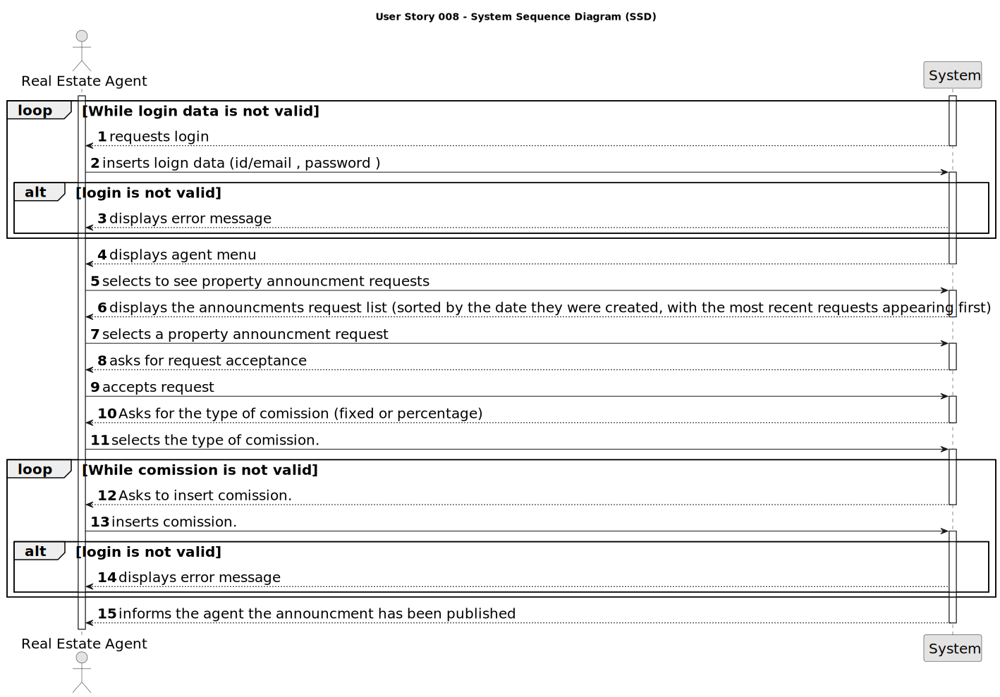

# US 008 - To select a request and publish an announcement.

## 1. Requirements Engineering

### 1.1. User Story Description

As an agent, I intend to see the list of property announcement requests made to myself,
so that I can post the announcement.

### 1.2. Customer Specifications and Clarifications 

**From the specifications document:**

> The real estate agent reviews property requests submitted by owner and selects one to accept. 

> As soon as the request is accepted he can publish the announcment linked to the request. 

**From the client clarifications:** //so falta isto + 1.7

> **Question:** Regarding US008, can the agent decline an announcement request?
> 
>**Answer**: Yes. The agent must include a message justifying the rejection.

> **Question:** When displaying the property announcement requests in the system to the agent besides them being ordered from most recent to oldest is there a need to display the specific day where the requests were published? 
> 
> **Answer:** The list of property announcement requests should be sorted by the date they were created, with the most recent requests appearing first. The system should show the date when the property announcement requests was made.

> **Question:** Can the agent select multiple requests at the same time?
> 
>**Answer:** No.The agent can only post one announcement at a time.

> **Question:** According to the Project Description, the agent when selling an agency can charge a flat price comission or a percentage of the sale value, my question here is wether there is a minimum and/or a maximum to each of these types of comissions?
>
> **Answer:** There is no maximum and the minimum is 0.

### 1.3. Acceptance Criteria

* **AC1:** The list of property announcement request should be sorted by the date they were created, with the most recent requests appearing first.
* **AC2:** An announcement is posted when a request is accepted. The list of requests should be refreshed, and that request should not be shown ag

### 1.4. Found out Dependencies

* There is a dependency to US004 since the agent receives a request from the owner trhough a
 phone call, or the application itself. Once he receives that request ,he than can validate the data, choose and announce it.

### 1.5 Input and Output Data

**Input Data:**

- Id/email
- Password

*After login*
- Selection of display request option
- Selection and acception of request

**Output Data:**

* Agent request list
* Announcment dispplay
* (In)Success of the operation

### 1.6. System Sequence Diagram (SSD) (not displays for a reason?)

### 1.7 Other Relevant Remarks

* -