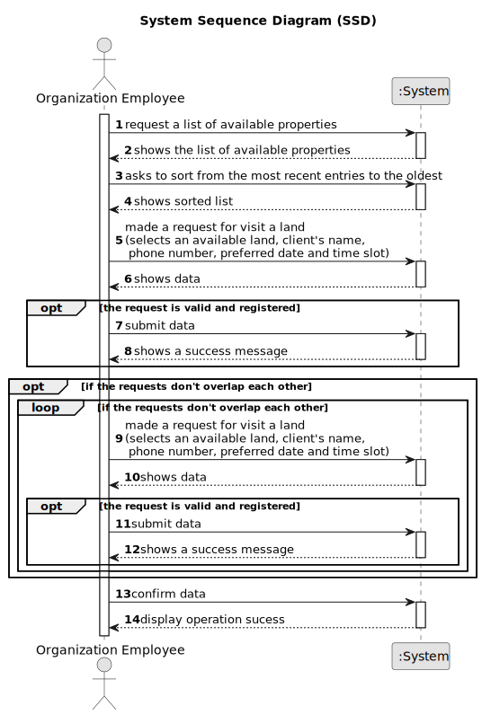

# To message the agent to schedule a visit to property of my interest.

## 1. Requirements Engineering

### 1.1. User Story Description

As a client, I want to leave a message to the agent to schedule a visit to a property of my interest.

### 1.2. Customer Specifications and Clarifications 

**From the specifications document:**

>	Each task is characterized by having a unique reference per organization, a designation, an informal and a technical description, an estimated duration and cost as well as the its classifying task category. 

>	As long as it is not published, access to the task is exclusive to the employees of the respective organization. 

**From the client clarifications:**

> **Question:** Can a client send multiple time slots?
>  
> **Answer:** Yes , the client can, as long as there is no overlap.

> **Question:** Can the same client send multiple request to visit different properties?
>  
> **Answer:** Yes , the client can, as long as the time slot and date do not coincide with other visits.

### 1.3. Acceptance Criteria

* **AC1:** . A list of available properties must be shown, sorted from the most recent
  entries to the oldest.
* **AC2:** The message must also include the client's name, phone number,
  preferred date and time slot (from x hour to y hour) for the property visit.
* **AC3:** A client may post multiple visit requests, but only if those do not overlap
  each other.
* **AC4:** The client must receive a success message when the request is valid and
  registered in the system.

### 1.4. Found out Dependencies

* There is a dependency to "US 002 - To publish an announcement " since need to have the list of the properties.

### 1.5 Input and Output Data

**Input Data:**

* Typed data:
	* preference date; 
	* preference time slot; 
	
* Selected data:
	* the property to visit

**Output Data:**

* message to confirm the visit
* (In)Success of the operation

### 1.6. System Sequence Diagram (SSD)

#### Alternative One

### 1.7 Other Relevant Remarks
