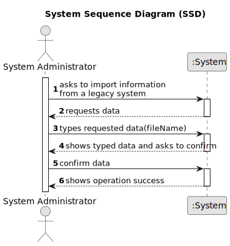

# US 012 - To import information from a legacy system

## 1. Requirements Engineering

### 1.1. User Story Description

As a system administrator, I want to import information from a legacy system that has been in use in several agencies.

### 1.2. Customer Specifications and Clarifications 

**From the specifications document:**

> n/a 

**From the client clarifications:**

> **Question:** Can the System Administrator, when wanting to import information from a legacy system, send more than one file at once?
>  
> **Answer:** Only one file at a time.

> **Question:** In the CSV containing the data from the legacy system, properties classified as Apartment have themselves a value for Sun Exposure. However, the specification document describes this attribute as exclusive to the land type House: "In case the land is a house, the existence of a basement, an inhabitable loft, and sun exposure must be registered as well.". Do we add Sun Exposure to the apartment's attributes or does it stay exclusive to house?
>  
> **Answer:**

> **Question:** It has been clearly previously established that there are two types of commissions (fixed and percentage). However, the CSV containing the data from the legacy system only has one column that references any type of commission: column U "commission(%)". Does that mean that there is only one type of commission, or was the fixed type accidentally left out or did I fail to notice the fixed commission type?
> 
> **Answer:**

### 1.3. Acceptance Criteria

* **AC1:** The system administrator must be able to choose a file to import.
* **AC2:** The system should only accept CSV files.
* **AC3:** The file content must be validated, showing a message to the system administrator if the file is empty or its content is not in the requested format.
* **AC4:** The import operation, when successful, should trigger a success message to the system administrator.

### 1.4. Found out Dependencies

* There is no dependency in another US. 

### 1.5 Input and Output Data

**Input Data:**

* Selected data:
	* File 

**Output Data:**

* (In)Success of the operation

### 1.6. System Sequence Diagram (SSD)

### 1.7 Other Relevant Remarks

* n/a