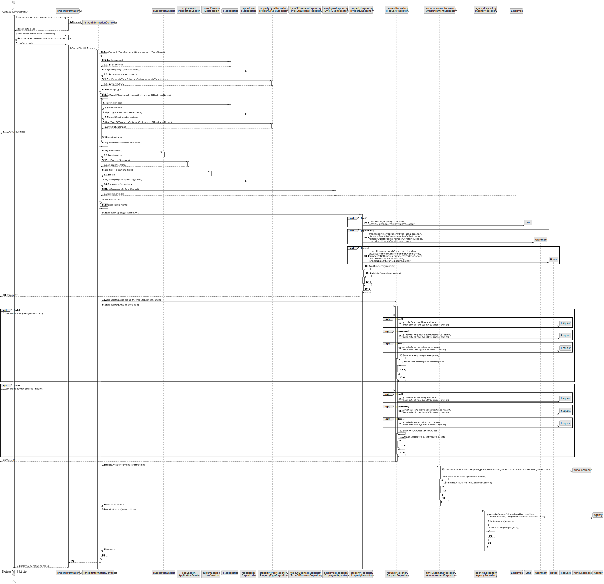
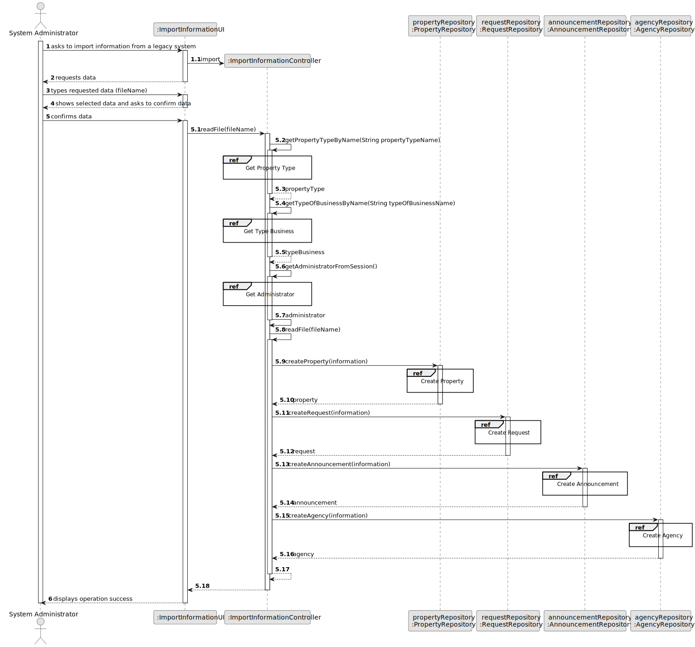
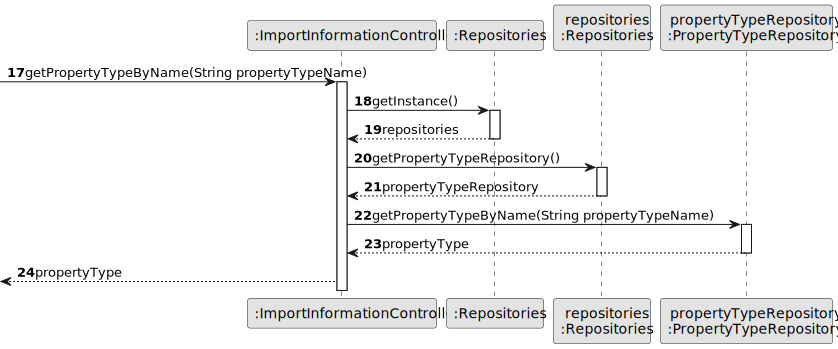
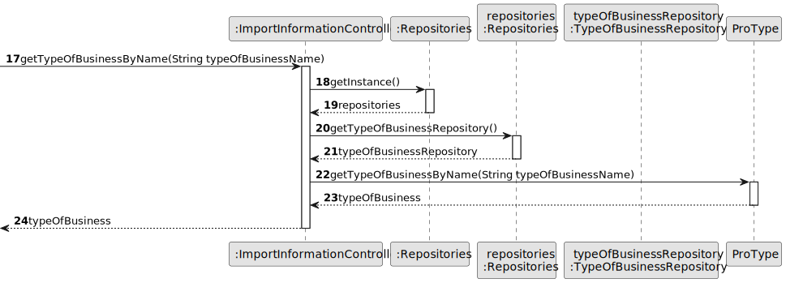
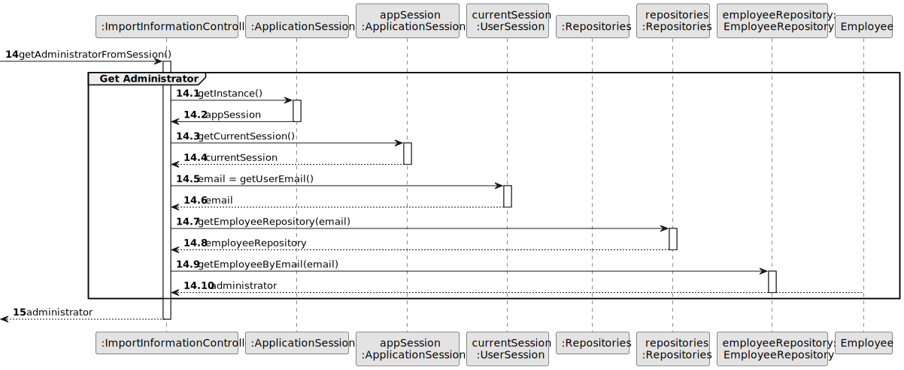
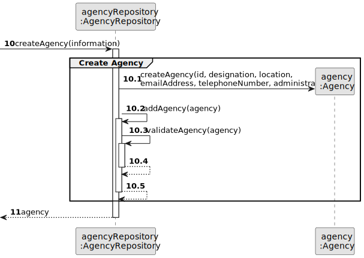
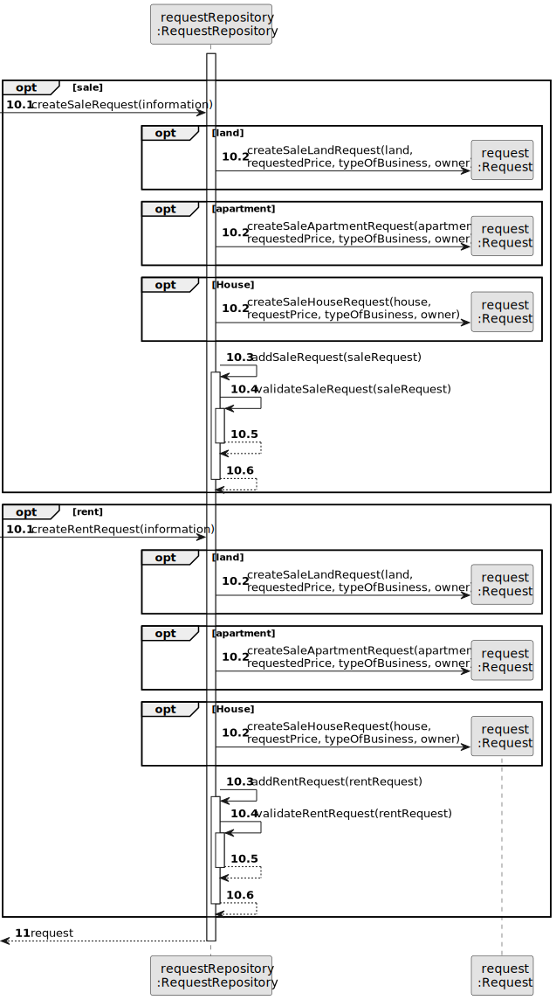
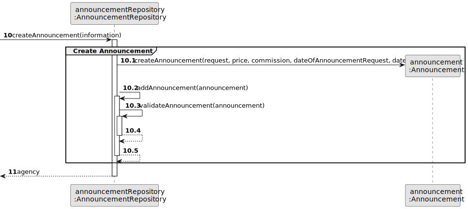
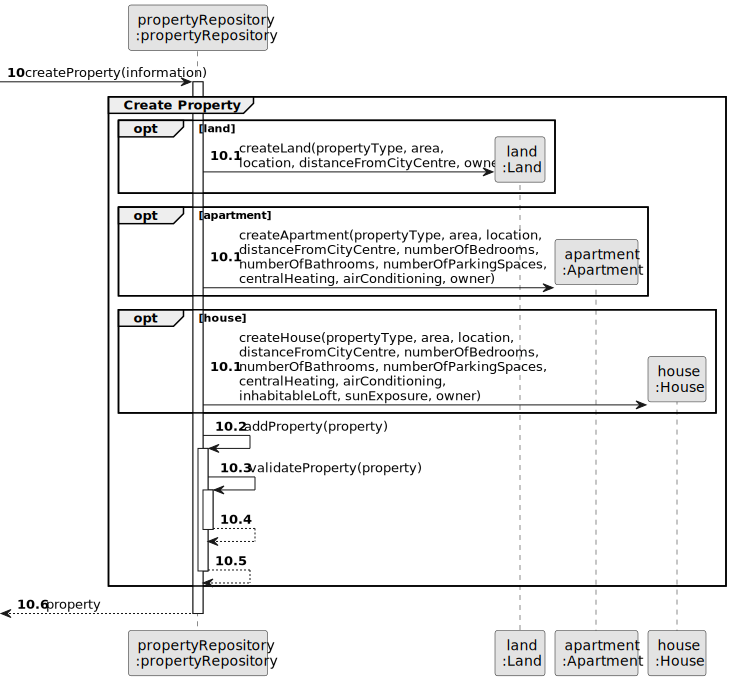
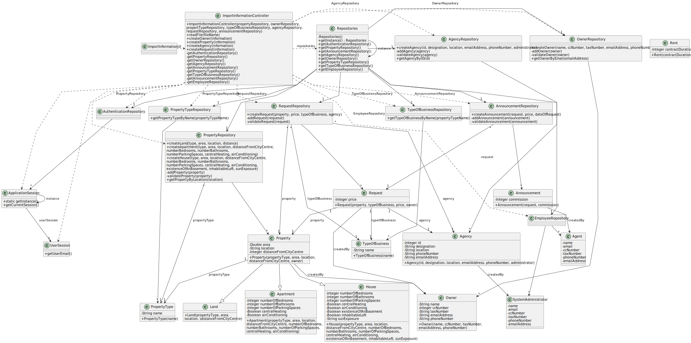

# US 012 - To import information from a legacy system

## 3. Design - User Story Realization 

### 3.1. Rationale

| Interaction ID | Question: Which class is responsible for...   | Answer                                                                                                       | Justification (with patterns)                                                                                 |
|:--------------|:----------------------------------------------|:-------------------------------------------------------------------------------------------------------------|:--------------------------------------------------------------------------------------------------------------|
| Step 1  		    | 	... interacting with the actor?              | ImportInformationUI                                                                                          | Pure Fabrication: there is no reason to assign this responsibility to any existing class in the Domain Model. |
| 			  		       | 	... coordinating the US?                     | ImportInformationController                                                                                  | Controller                                                                                                    |
| 			  		       | ... knowing the user using the system?        | UserSession                                                                                                  | IE: cf. A&A component documentation.                                                                          |
| 			  		       | 							                                       | EmployeeRepository                                                                                           | IE: knows/has its own Employees(administrator)                                                                |
| 			  		       | 							                                       | Employee                                                                                                     | IE: knows its own data (e.g. email)                                                                           |
| Step 2        |                                               |                                                                                                              |                                                                                                               |
| Step 3        |                                               |                                                                                                              |                                                                                                               |
| Step 4  		    | 							                                       |                                                                                                              |                                                                                                               |
| Step 5		      | 	...saving the inputted data?                 | ImportInformationController                                                                                  | IE: object created in step 1 has its own data.                                                                |
| Step 6        | 	                                             | PropertyTypeRepository                                                                                       | IE: Property Types are defined by the Administrators.                                                         |
|               |                                               | PropertyTypeRepository                                                                                       | IR: Types Of Business are defined by the Administrators.                                                      |
| 		            | 	... creating the Agency?                     | AgencyRepository                                                                                             | IE: o                                                                                                         |
|		             | 	... creating the Announcement?						         | AnnouncementRepository                                                                                       | IE: owns its data.                                                                                            |              
|               | ...creating the Property?                     | PropertyRepository                                                                                           |IE: owns its data.                                                                                                                |
|                | ...creating the request?                      | RequestRepository                                                                                            | IE: owns its data.                                                                                                               |
|                | ...creating the Owner?                        | OwnerRepository                                                                                              |  IE: owns its data.                                                                                                              |
| Step 7  		    | 	... validating all data (local validation)?  | Agency Announcement Property Request Owner                                                   | IE: owns its data.                                                                                            | 
| 			  		       | 	... validating all data (global validation)? | AgencyRepository AnnouncementRepository PropertyRepository RequestRepository OwnerRepository | IE: knows all its tasks.                                                                                      | 
| 			  		       | 	... saving the created task?                 | AgencyRepository AnnouncementRepository PropertyRepository RequestRepository OwnerRepository | IE: owns all its tasks.                                                                                       | 
| Step 8  		    | 	... informing operation success?             | ImportInformationUI                                                                                          | IE: is responsible for user interactions.                                                                     | 

### Systematization ##

According to the taken rationale, the conceptual classes promoted to software classes are: 

* AgencyRepository
* OwnerRepository
* PropertyRepository
* RequestRepository
* AnnouncementRepository
* Agency
* Owner
* Property
* Request
* Announcement

Other software classes (i.e. Pure Fabrication) identified: 

 * ImportInformationUI
 * ImportInformationController

## 3.2. Sequence Diagram (SD)

### Alternative 1 - Full Diagram

### Alternative 2 - Split Diagram

This diagram shows the same sequence of interactions between the classes involved in the realization of this user story, but it is split in partial diagrams to better illustrate the interactions between the classes.

It uses interaction ocurrence.

**Get Property Type Partial SD**

**Get Type Of Business**

**Get Administrator**

**Create Agency**

**Create Request**

**Create Announcement**

**Create Property**

## 3.3. Class Diagram (CD)

