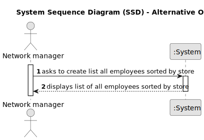

# US 013 - List all employees working in every store 

## 1. Requirements Engineering

### 1.1. User Story Description

As a network manager, I want to list all employees working in every store
of the network

### 1.2. Customer Specifications and Clarifications 

**From the specifications document:**

>	Each store in the network has a store manager and the set of stores is managed by a store network
manager. The main functions of a store manager are to monitor and streamline the branch with the
aim of getting to know better the business carried out and to analyse and evaluate the performance
of employees

**From the client clarifications:**

> **Question:** Do you want a list where the header is ID, the name of the store, and the total number of listings that the store has?
>
> **Answer:** Yes.

> **Question:** And the alphabetical list of employees of that store repeated from the store with the most land listings to the one with the least land listings.
>
> **Answer:** The answer to this question is to read carefully the acceptance criteria for this US and discuss them with your team...

### 1.3. Acceptance Criteria

* **AC1:** The list of employees should be alphabetically sorted and grouped by store.
* **AC2:** Stores should be sorted according to their land listings, from the one with more listings to the one with less listings.
* **AC3:** Each store should state how many land listings it has.

### 1.4. Found out Dependencies

* There is a dependency to "US003 REgister a new employee" since at least one employee must exist to be listed.
* There is a dependency to "US005 Register a new store" since at least one store must exist to be listed.

### 1.5 Input and Output Data

**Input Data:**

* Typed data:
	* none
	
* Selected data:
	* Menu option to list all employees 

**Output Data:**

* List of all employees of the network, grouped by store.

### 1.6. System Sequence Diagram (SSD)

**Other alternatives might exist.**

#### Alternative One

### 1.7 Other Relevant Remarks

* none