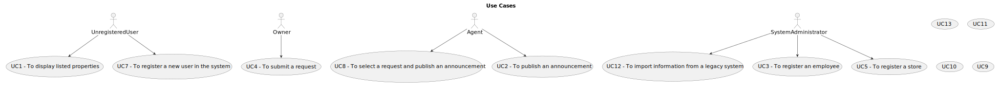

# Use Case Diagram (UCD)

**In the scope of this project, there is a direct relationship of _1 to 1_ between Use Cases (UC) and User Stories (US).**

However,this is a pedagogical simplification. On further projects and curricular units might also exist _1 to
N **and/or** N to 1 relationship between US and UC.

**Use Case Diagram in a SVG format**

**For each UC/US, it must be provided evidences of applying main activities of the software development process (
requirements, analysis, design, tests and code). Gather those evidences on a separate file for each UC/US and set up a
link as suggested below.**

# Use Cases / User Stories

| UC/US  | Description                                                                                                                                            |                   
|:-------|:-------------------------------------------------------------------------------------------------------------------------------------------------------|
| US 001 | [Display listed properties](../../us001/US001-menu.md)                                                                                                 |
| US 002 | [Publish an announcement ](../../us002/US002-menu.md)                                                                                                  |
| US 003 | [Register a new employee](../../us003/US003-menu.md)                                                                                                   | 
| US 004 | [Submit a request](../../us004/US004-menu.md)                                                                                                          |
| US 005 | [Register a store](../../us005/US005-menu.md)                                                                                                          |
| US 007 | [Register a new user in the system](../../us007/US007-menu.md)                                                                                         |                                                    |
| US 008 | [Select a request and publish an announcement](../../US008/Readme.md)                                                                                  |
| US 009 | [Request a visit to a land](../../US009/Readme.md)                                                                                                     |
| US 010 | [Place and submit a purchase order (with the respective amoount)](../../US010/Readme.md)                                                               | 
| US 011 | [List and decide (whether to accept or decline) a real estate purchase and send an email to the customer in case of acceptance](../../US011/Readme.md) |
| US 012 | [Register a store](../../US012/Readme.md)                                                                                                              |
| US 013 | [Register a store](../../US013/Readme.md)                                                                                                              |

