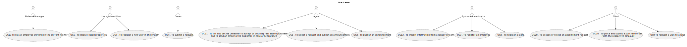

# Use Case Diagram (UCD)

**In the scope of this project, there is a direct relationship of _1 to 1_ between Use Cases (UC) and User Stories (US).**

However,this is a pedagogical simplification. On further projects and curricular units might also exist _1 to
N **and/or** N to 1 relationship between US and UC.

**Use Case Diagram in a SVG format**

**For each UC/US, it must be provided evidences of applying main activities of the software development process (
requirements, analysis, design, tests and code). Gather those evidences on a separate file for each UC/US and set up a
link as suggested below.**

# Use Cases / User Stories

| UC/US  | Description                                        |                   
|:-------|:---------------------------------------------------|
| US 008 | [Display listed properties](../../US008/Readme.md) |
| US 009 | [Publish an announcement ](../../US009/Readme.md)  |
| US 010 | [Register a new employee](../../US010/Readme.md)   | 
| US 011 | [Submit a request](../../US011/Readme.md)          |
| US 012 | [Register a store](../../US012/Readme.md)          |
| US 013 | [Register a store](../../US013/Readme.md)          |

