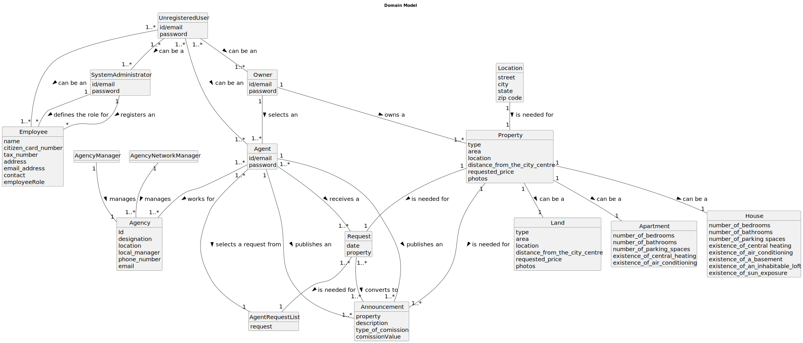

# Analysis

The construction process of the domain model is based on the client specifications, especially the nouns (for _concepts_) and verbs (for _relations_) used. 

## Rationale to identify domain conceptual classes ##
To identify domain conceptual classes, start by making a list of candidate conceptual classes inspired by the list of categories suggested in the book "Applying UML and Patterns: An Introduction to Object-Oriented Analysis and Design and Iterative Development". 

### _Conceptual Class Category List_ ###

**Business Transactions**

*

---

**Transaction Line Items**

*

---

**Product/Service related to a Transaction or Transaction Line Item**

* Property

---

**Transaction Records**

*  

---  

**Roles of People or Organizations**

* System Administrator
* Employee
* Store Manager
* Network Manager
* Agent
* Owner
* Client

---

**Places**

* Agency
* Land
* Apartment
* House

---

**Noteworthy Events**

* 

---

**Physical Objects**

*

---

**Descriptions of Things**

* Employee Role
* Property Location

---

**Catalogs**

*  

---

**Containers**

*  

---

**Elements of Containers**

*  

---

**Organizations**

*

---

**Other External/Collaborating Systems**

---

**Records of finance, work, contracts, legal matters**

* 

---

**Financial Instruments**

*  

---

**Documents mentioned/used to perform some work/**

* 
---

###**Rationale to identify associations between conceptual classes**###

An association is a relationship between instances of objects that indicates a relevant connection and that is worth of remembering, or it is derivable from the List of Common Associations: 

+ **_A_** is physically or logically part of **_B_**
+ **_A_** is physically or logically contained in/on **_B_**
+ **_A_** is a description for **_B_**
+ **_A_** known/logged/recorded/reported/captured in **_B_**
+ **_A_** uses or manages or owns **_B_**
+ **_A_** is related with a transaction (item) of **_B_**
+ etc.

| Concept (A) 		          |   Association   	   | Concept (B)         |
|-------------------------|:-------------------:|---------------------|
| System Administrator  	 |     Creates   	     | Employee            |
| Employee Role           |  Contained in   	   | Employee            |
| Employee                |   Works for    	    | Agency              |
| Company                 |      Contains       | Agency              |
| System Administrator    |       Manages       | Company             |
| Owner                   |        Owns         | Property            |
| Owner                   |       Selects       | Agent               |
| Agent                   |      Works for      | Agency              |
| House                   | Is a description of | Property            |
| Apartment               | Is a description of | Property            |
| Land                    | Is a description of | Property            |
| Agent                   |       Creates       | Announcement        |
| System Administrator    |       Creates       | Agency              |
| Agency Manager          |       Manages       | Agency              |
| Network Manager         |       Manages       | Agencies            |
| Client                  |         is          | User                |
| Owner                   |         is          | User                |
| System Administrator    |         is          | User                |
| Agent                   |         is          | User                |
| Agent                   |        sends        | Appointment Request |
| Client                  | accepts or rejects  | Appointment Request |

## Domain Model

