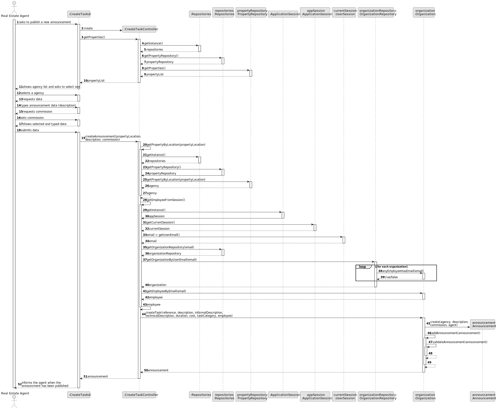
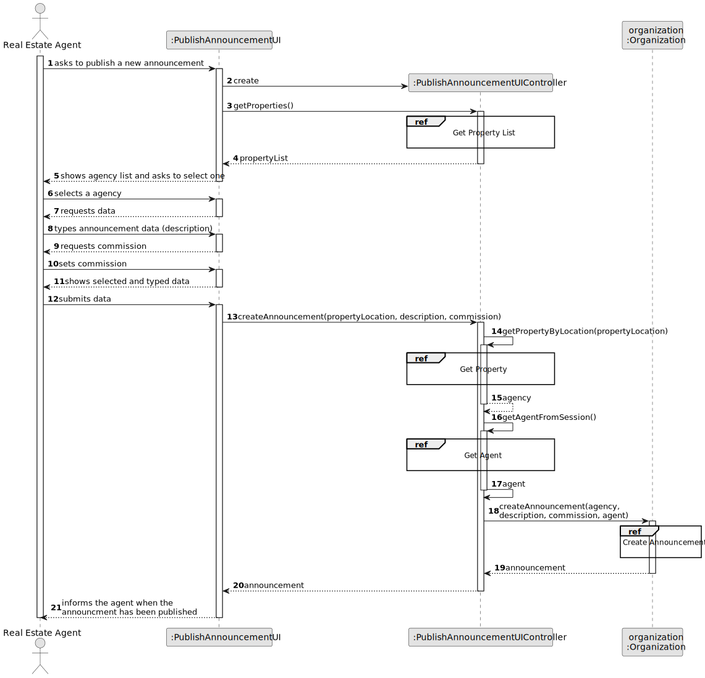
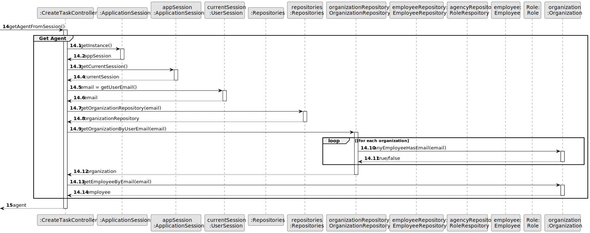
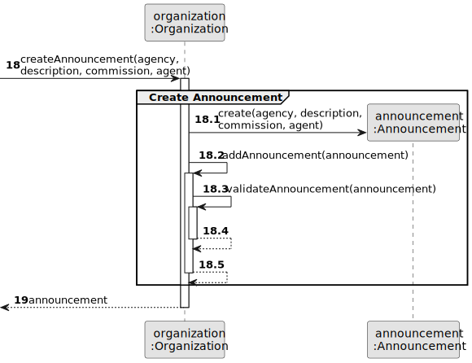
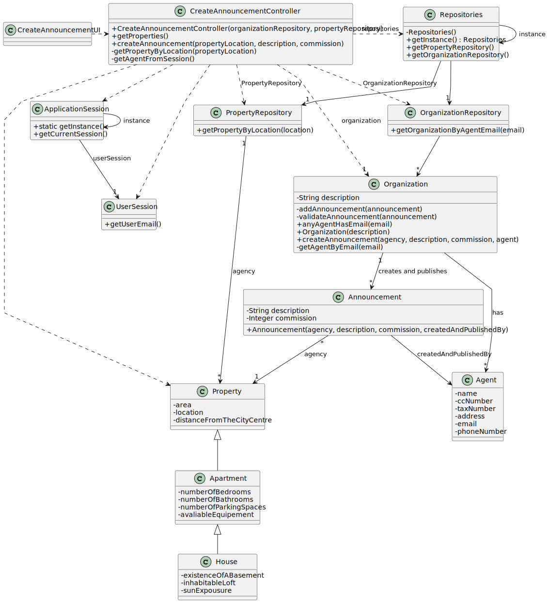

# US 001 - To display listed properties.

## 3. Design - User Story Realization 

### 3.1. Rationale

| Interaction ID | Question: Which class is responsible for...        | Answer                        | Justification (with patterns)                                                                                 |
|:---------------|:---------------------------------------------------|:------------------------------|:--------------------------------------------------------------------------------------------------------------|
| Step 1  		     | 	... interacting with the actor?                   | PublishAnnouncementUI         | Pure Fabrication: there is no reason to assign this responsibility to any existing class in the Domain Model. |
| 			  		        | 	... coordinating the US?                          | PublishAnnouncementController | Controller                                                                                                    |
| 			  		        | 	... instantiating a new Announcement?             | Organization                  | Creator (Rule 1): in the DM Organization has a Announcement.                                                  |
| 			  		        | ... knowing the user using the system?             | UserSession                   | IE: cf. A&A component documentation.                                                                          |
| 			  		        | 							                                            | Organization                  | IE: knows/has its own Agents                                                                                  |
| 			  		        | 							                                            | Agent                         | IE: knows its own data (e.g. email)                                                                           |
| Step 2  		     | 	...knowing the properties to show? 						         | System                        | IE: IE: Properties are defined by the Owners, who sent a request to an Agent.                                 |
| Step 3 		      | 	...saving the seletcted agency?                 | Announcement                  | IE: object created in step 1 is classified in one Property.        |
| Step 4  		     | 	                                                  |                               |                                                                                                               |
| Step 5	        | 	... saving the inputted data?                     | Announcement                  | IE: objects created in step 1 has its own data.                                                               |
| 	              | 	... validating all data (local validation)?       | Annoncement                   | IE: owns its data.                                                                                            | 
| 			  		        | 	... validating all data (global validation)?      | Organization                  | IE: knows all its tasks.                                                                                      | 
| 			  		        | 	... saving the created task?                      | Organization                  | IE: owns all its tasks.                                                                                       | 
| Step 6  		     | 	... informing that the announcement is published? | PublishAnnouncementUI         | IE: is responsible for user interactions.                                                                     | 

### Systematization ##

According to the taken rationale, the conceptual classes promoted to software classes are: 

 * Organization
 * Announcement

Other software classes (i.e. Pure Fabrication) identified: 

 * PublishAnnouncementUI  
 * PublishAnnouncementController

## 3.2. Sequence Diagram (SD)

### Alternative 1 - Full Diagram

This diagram shows the full sequence of interactions between the classes involved in the realization of this user story.

### Alternative 2 - Split Diagram

This diagram shows the same sequence of interactions between the classes involved in the realization of this user story, but it is split in partial diagrams to better illustrate the interactions between the classes.

It uses interaction ocurrence.

**Get Property Partial SD**

**Get Property**

**Get Agent**

**Create Announcement**

## 3.3. Class Diagram (CD)

