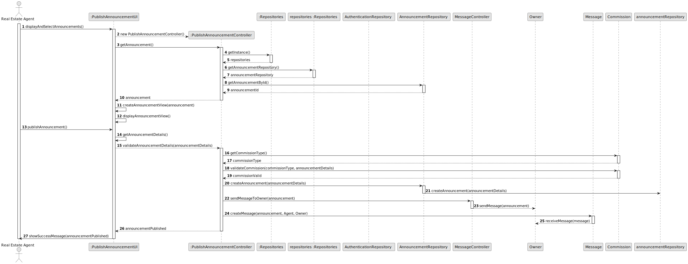
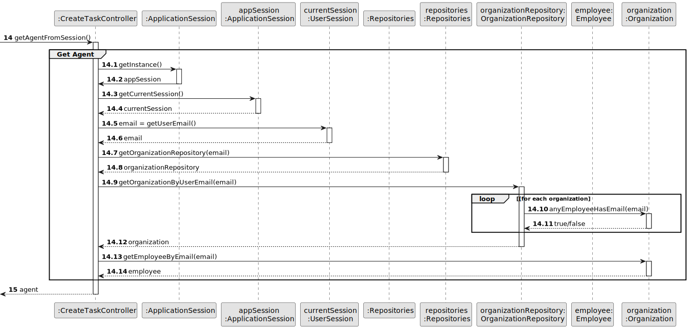
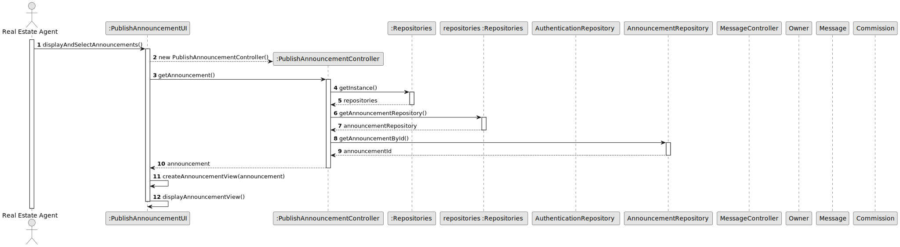
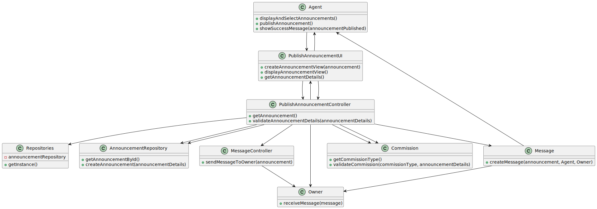

# UUS 002 - To publish an announcement

## 3. Design - User Story Realization 

### 3.1. Rationale

| Interaction ID | Question: Which class is responsible for...            | Answer                       | Justification (with patterns)                                                                                                                                                            |
|:---------------|:-------------------------------------------------------|:-----------------------------|:-----------------------------------------------------------------------------------------------------------------------------------------------------------------------------------------|
| Step 1         | ... requesting login of the US?                        | MainMenuUI                   | Pure Fabrication: there is no reason to assign this responsibility to any existing class in the Domain Model.                                                                            |
| Step 2         | .. displaying agent menu?                              | AgentUI                      | Pure Fabrication: AgentUI is responsible for displaying the agent menu to the real estate agent.                                                                                         |
| Step 3         | .. asking for the type of commission? 						           | PublishAnnouncementUI        | The agent only is asked for the commission when pubishing an announcement.                                                                                                               |
| Step 4         | ... selecting the type of commission?                  | Agent                        | Agent selects the type of commission for the announcement.                                                                                                                               |
| Step 5         | ... asking to insert commission?                       | PublishAnnouncementUI        | Pure Fabrication: AgentUI requests the agent to input the commission value.                                                                                                              |
| Step 6         | ... inserting commission?                              | Agent                        | Agent enters the commission value.                                                                                                                                                       |
| Step 7         | ... validating the commission                          | PublishAnnouncmentController | The commission is validated in the controller ,after UI gets the commision it comunicates with the controller to validate it.                                                            | 
| Step 8  	      | ...displaying error message if commission is invalid   | PublishAnnouncmentUI         | After the controller valides the commision ,it comunicates with the UI sending it the boolen answer to the commmision , if it is false the PublishAnnouncment interface informs the user |
| Step 9         | ...accepting /declining the announcement confirmation? | Agent                        | Agent chooses to accept or either  decline the confirmation of publishing the announcement.                                                                                              |
| Step 10        | ... displaying success message?                        | PublishAnnouncmentUI         | Pure Fabrication: PublishAnnouncmentUI displays a success message, informing the agent that the announcement has been published successfully                                             |

### Systematization ##

According to the taken rationale, the conceptual classes promoted to software classes are: 

 * Agent
 * AgentUI
* PublishAnnouncementUI
* PublishAnnouncementController

Other software classes (i.e. Pure Fabrication) identified: 

 * Announcement  
 * Commission

## 3.2. Sequence Diagram (SD)

### Alternative 1 - Full Diagram

This diagram shows the full sequence of interactions between the classes involved in the realization of this user story.

**Get Property Partial SD**

**Get Property**

**Get Agent**

**Create Announcement**

## 3.3. Class Diagram (CD)

