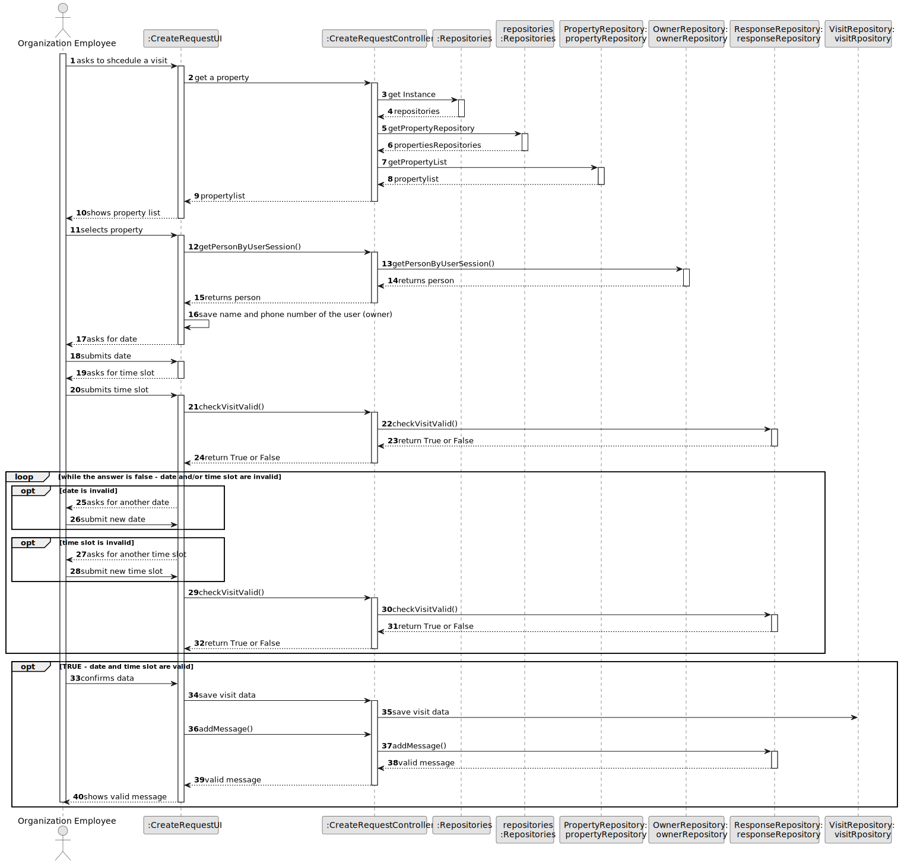
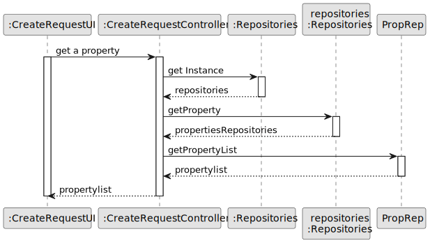
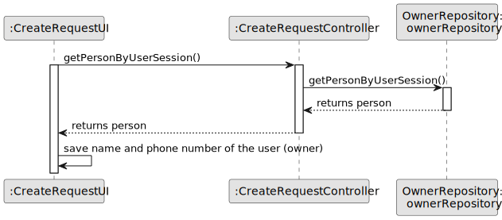
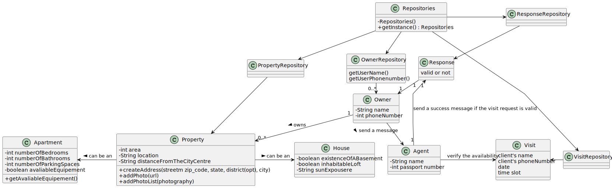

# US009 - To message the agent to schedule a visit to property of my interest.

## 3. Design - User Story Realization 

### 3.1. Rationale

**SSD - Alternative 1 is adopted.**

| Interaction ID | Question: Which class is responsible for...           | Answer                  | Justification (with patterns)                   |
|:---------------|:------------------------------------------------------|:------------------------|:------------------------------------------------|
| Step 1  		     | asks the list f properties?                           | Client                  | IE : Wants to see the list to choose a property |
| 	Step 2		  		  | show the list to the client?	                         | CreateRequestUI         | Pure Fabrication                                |
| 	Step 3		  		  | choose a property?                                    | Client                  | IE : Wants to choose the property to visit.     |
| Step 4			  		  | request property visit data?							                   | CreateRequestController | Controller                                      |
| 	Step 5		  		  | type property visit data?							                      | Client                  | IE: knows the data (e.g.date, time slot )       |
| Step 6         | asks to confirm data?                                 | CreateRequestUI         | Pure Fabrication                                |
| Step 7  		     | confirm data?							                                  |                         | IE: knows the data (e.g.date, time slot )       |
| Step 8  		     | 	Confirm if the visit is possible?                    | CreateRequestUI         | Pure Fabrication                                |
|                | Send a sucess mesage if the visit is possible?        | CreateRequestController | Controller                                      |
| Step 9  		     | 	asks a new date and/or time slot in case of overlap? | CreateRequestUI         | Pure Fabrication                                |
| Step 10  		    | 	submit new data?                                     | Client                  | IE: knows the data (e.g.date, time slot )       |
| Step 11  		    | 	asks to confirm data? 					                          |          | Pure Fabrication                                |              
| Step 12  		    | 	confirm data?                                        | Client                  | IE: knows the data (e.g.date, time slot )       | 
| Step 13			  		 | 	Confirm if the visit is possible?                    | CreateRequestUI         | Pure Fabrication                                | 
| 			  		        | 	Send a sucess mesage if the visit is possible?       | CreateRequestController            | Controller                                      | 
| Step 14 		     | 	asks to confirm data?                                | CreateRequestUI          | Pure Fabrication                                | 
| Step 15        |   informing operation success?                                                     |  CreateRequestUI                       | IE: is responsible for user interactions.       |

### Systematization ##

According to the taken rationale, the conceptual classes promoted to software classes are: 

 * Organization
 * Task

Other software classes (i.e. Pure Fabrication) identified: 

 * CreateTaskUI  
 * CreateTaskController

## 3.2. Sequence Diagram (SD)

### Alternative 1 - Full Diagram

This diagram shows the full sequence of interactions between the classes involved in the realization of this user story.

### Alternative 2 - Split Diagram

This diagram shows the same sequence of interactions between the classes involved in the realization of this user story, but it is split in partial diagrams to better illustrate the interactions between the classes.

It uses interaction ocurrence.

**Get property**

**Get user information**

## 3.3. Class Diagram (CD)

