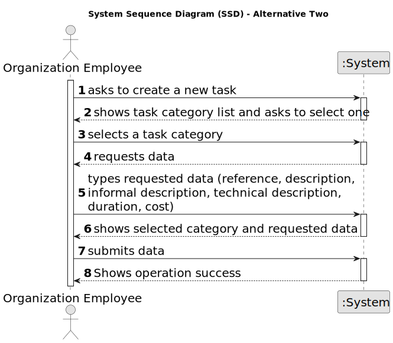

# US 011 - To list and decide (whether to accept or decline) real estate purchase and to send an email to the customer in case of acceptance

## 1. Requirements Engineering

### 1.1. User Story Description

As an agent,I want to list real estate purchase orders to accept or decline a purchase order for a property. 
After accepting or declining, an email notification should be sent to the customer.

### 1.2. Customer Specifications and Clarifications 

**From the specifications document:**

>	Each task is characterized by having a unique reference per organization, a designation, an informal and a technical description, an estimated duration and cost as well as the its classifying task category. 

>	As long as it is not published, access to the task is exclusive to the employees of the respective organization. 

**From the client clarifications:**

> **Question:** When the agent wants to list real estate purchase orders, does he/she list all of them at once or can a land be chosen to list the purchase orders that are related to that specific land?
>
>**Answer:** The properties should be sorted from the oldest to the most recent one. For each land, the list of purchase orders should be sorted by the amount offered, the highest offer must appear first.

> **Question:** Monetary data is expressed in any particular currency?
>  
> **Answer:** Monetary data (e.g. estimated cost of a task) is indicated in POTs (virtual currency internal to the platform).

### 1.3. Acceptance Criteria

* **AC1:** The list of purchase orders should be grouped by property. The properties should be sorted from the oldest to the most recent one. For each property, the list of purchase orders should be sorted by the amount offered, the highest offer must appear first.
* **AC2:** For each offer, the agent must be able to accept or decline it. The action of accepting or declining an offer should trigger an email notification to the client.
* **AC3:** When a purchase order is accepted, all the other orders should be declined, and a message sent to the client.
* **AC4:** If a property does not contain any offers, the system should show an empty list of offers.

### 1.4. Found out Dependencies

* There is a dependency to "US003 Create a task category" since at least a task category must exist to classify the task being created.

### 1.5 Input and Output Data

**Input Data:**

* Typed data:
	* a reference, 
	* a designation, 
	* an informal description
	* a technical description
	* an estimated duration
	* an estimated cost
	
* Selected data:
	* Classifying task category 

**Output Data:**

* List of existing task categories
* (In)Success of the operation

### 1.6. System Sequence Diagram (SSD)

**Other alternatives might exist.**

#### Alternative One

#### Alternative Two

### 1.7 Other Relevant Remarks

* The created task stays in a "not published" state in order to distinguish from "published" tasks.