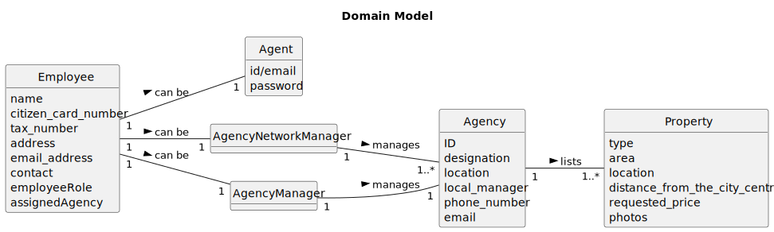

# US 013 - To list all employees working of the network.

## 2. Analysis

### 2.1. Relevant Domain Model Excerpt 

### 2.2. Other Remarks

> * An Agency is the same as a Store.
>
> * Agencies keep record of Property Listings.
>
> * With this excerpt we can we can list employees by store and the number of land listings that each store has.