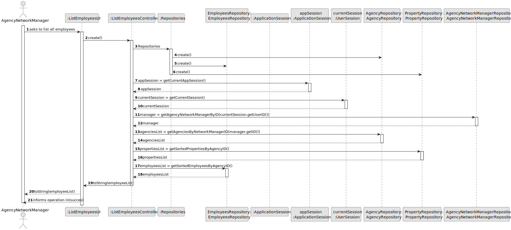
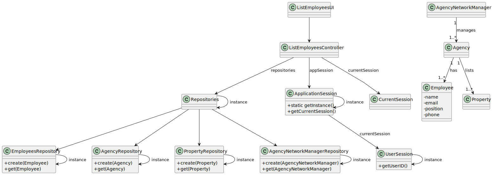

# US 013 - To list all employees working of the network.

## 3. Design - User Story Realization 

### 3.1. Rationale

**SSD - Alternative 1 is adopted.**

| Interaction ID | Question: Which class is responsible for... | Answer                         | Justification (with patterns)                                                                                 |
|:---------------|:--------------------------------------------|:-------------------------------|:--------------------------------------------------------------------------------------------------------------|
| Step 1  		     | 	... interacting with the actor?            | ListEmployeesUI                | Pure Fabrication: there is no reason to assign this responsibility to any existing class in the Domain Model. |
| 			  		        | 	... coordinating the US?                   | ListEmployeesController        | Controller                                                                                                    |
| 			  		        | 	... instantiating a new Repository?        | Repository                     | Repository - IE                                                                                               |
| 			  		        | ... knowing the user using the system?      | UserSession                    | IE: cf. A&A component documentation.                                                                          |
| 			  		        | 							                                     | AgencyNetworkManagerRepository | Repository - IE                                                                                               |
| 			  		        | 							                                     | EmployeeRepository             | Repository - IE                                                                                               |
|                | ... sorting the agencies?                   | AgencyRepository               | Repository - IE                                                                                               |
|                | ...knowing the properties in each agency?   | PropertyRepository             | Repository - IE                                                                                               |
|                | ...knowing the employees in each agency?    | EmployeeRepository             | Repository - IE                                                                                               |
| Step 2  		     | 	... informing operation success						      | ListEmployeesUI                | Pure Fabrication: there is no reason to assign this responsibility to any existing class in the Domain Model  |

### Systematization ##

According to the taken rationale, the conceptual classes promoted to software classes are: 

 * AgencyNetworkManager

Other software classes (i.e. Pure Fabrication) identified: 

 * ListEmployeesUI
 * ListEmployeesController
 * EmployeeRepository

## 3.2. Sequence Diagram (SD)

### Alternative 1 - Full Diagram

This diagram shows the full sequence of interactions between the classes involved in the realization of this user story.

## 3.3. Class Diagram (CD)

