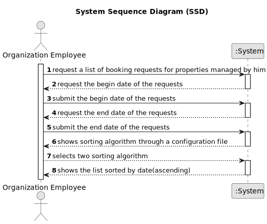

# US 015 - To list all booking requests.

## 1. Requirements Engineering

### 1.1. User Story Description

As an agent, I intend to list all booking requests for properties managed by me.

### 1.2. Customer Specifications and Clarifications 

**From the specifications document:**

>	The client can request to schedule a visit to the real estate agent for a specific property to verify its conditions.

>   The agent intends to receive the request, check its availability and send a response.

**From the client clarifications:**

### 1.3. Acceptance Criteria

* **AC1:** The list of requests must be shown for a specific period (begin date, end
  date).
* **AC2:** . The list of requests must be sorted by date in ascending order. The sorting algorithm to be used by the application must be defined through a configuration file. At least two sorting algorithms should be available.

### 1.4. Found out Dependencies

* There is a dependency with the "US004 - to submit a request" because in the request that are listed in us015 are created in us04.
* There is a dependency with the "US9" because in that US the client leaves a message for the agent, that will be reviewed by the agent in this US.

### 1.5 Input and Output Data

**Input Data:**

* Typed data:
	* begin date
    * end date
    * The type of sorting algorithm chosen.
	
* Selected data:
	* property request

**Output Data:**

* success message

### 1.6. System Sequence Diagram (SSD)

### 1.7 Other Relevant Remarks
