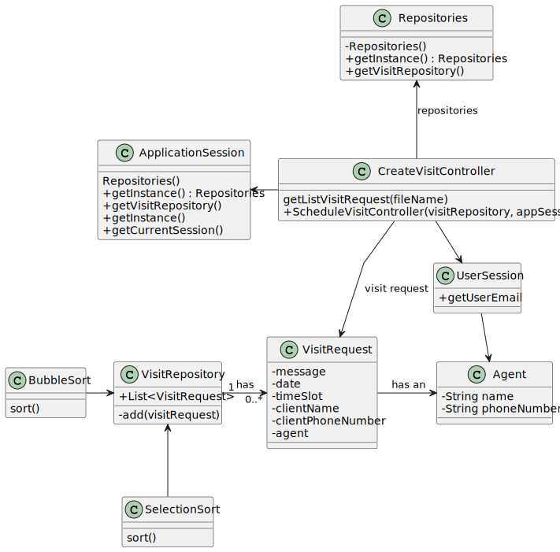

# US 015 - To list all booking requests.

## 3. Design - User Story Realization 

### 3.1. Rationale

**SSD - Alternative 1 is adopted.**

| Interaction ID | Question: Which class is responsible for...   | Answer                   | Justification (with patterns)                                |
|:---------------|:----------------------------------------------|:-------------------------|:-------------------------------------------------------------|
| Step 1  		     | 	... request a list of visit request?         | Agent                    | IE: request the list of request of properties managed by him |
| Step 2 			  		 | 	... request begin date of the requests list? | ListVisitUI              | Pure Fabrication                                             |
| Step 3         | ...submits the begin date?                    | Agent                    | IE : choose the date                                         |
| Step 4         | ...request end date of the requests list?     | ListVisitUI              | Pure Fabrication                                             |
| Step 5         | ...submits the end date?                      | Agent                    | IE: choose the date                                          |
| Step 6			  		  | ...shows begin and end date?                  | ListVisitUI              | Pure Fabrication                                             |
| Step 7			  		  | ...sort the list of visit?							             | BubbleSort/SelectionSort | IE: has the algorithms                                       |
| Step 8  		     | ... shows sorted list of visit? 							       | ListVisitUI              | Pure Fabrication                                             |

### Systematization ##

According to the taken rationale, the conceptual classes promoted to software classes are: 

 * Client
 * BubbleSort
 * SelectionSort

Other software classes (i.e. Pure Fabrication) identified: 

 * ListVisitRequestUI  
 * ListVisitRequestController

## 3.2. Sequence Diagram (SD)

### Alternative 1 - Full Diagram

This diagram shows the full sequence of interactions between the classes involved in the realization of this user story.

## 3.3. Class Diagram (CD)

