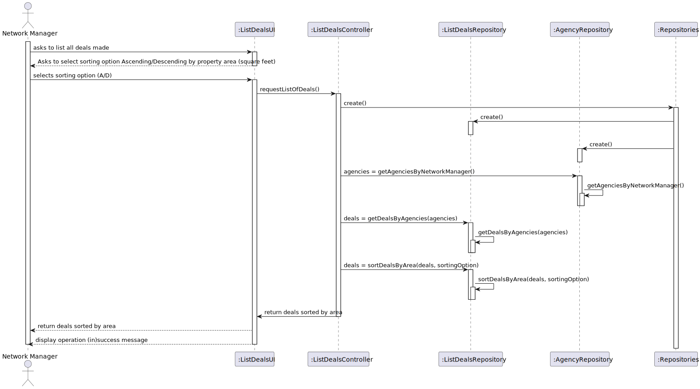

# US 017 - To List all deals made.

## 3. Design - User Story Realization 

### 3.1. Rationale

**SSD - Alternative 1 is adopted.**

| Interaction ID | Question: Which class is responsible for... | Answer              | Justification (with patterns)                                                                                 |
|:-------------  |:--------------------------------------------|:--------------------|:--------------------------------------------------------------------------------------------------------------|
| Step 1  		 | 	... interacting with the actor?            | ListDealsUI         | Pure Fabrication: there is no reason to assign this responsibility to any existing class in the Domain Model. |
| 			  		 | 	... coordinating the US?                   | ListDealsController | Controller                                                                                                    |
| 			  		 | 	... instantiating the Repositories?        | Repositorires       | Repository                                                                                                    |
| 			  		 | ... knowing the user using the system?      | UserSession         | IE: cf. A&A component documentation.                                                                          |
| Step 2  		 | 	... retrieving the requested information?  | DealsRepository     | Repository                                                                                                    |
### Systematization ##

According to the taken rationale, the conceptual classes promoted to software classes are: 

 * Deal

Other software classes (i.e. Pure Fabrication) identified: 

 * ListDealsUI  
 * ListDealsController

## 3.2. Sequence Diagram (SD)

### Full Diagram

This diagram shows the full sequence of interactions between the classes involved in the realization of this user story.

