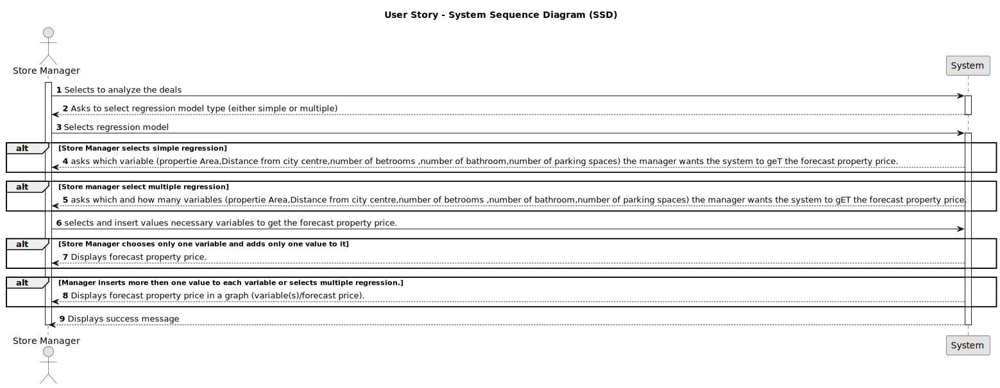

# US 018 - To analyze the deals made and to compare  the properties' sale values with the forecast ones.

## 1. Requirements Engineering

### 1.1. User Story Description

As a store manager, I intend to analyse the deals (only sale of houses and apartments) made. In particular, I intend to compare property sale values with the forecast values.

### 1.2. Customer Specifications and Clarifications 

**From the specifications document:**

>	The prediction of the value of the business/property must be estimated based on the characteristics of the property and using linear and multilinear regression algorithms.

>	There should be a diferent grahp for each diferent variable appliead on the regression .

**From the client clarifications:**

>> **Question:** When the store manager selects simple-linear regression to analyse the deals, does he also select one of the specified relevant parameters to serve as the [in]dependent variable in the regression model? ("property area in square feet, the distance from the center, the number of bedrooms, the number of bathroomsand the number of parking spaces").
> 
 >**Answer:** The store manager should choose the independent variable and the regression model to be used to fit the data.
>**Important:** The property area is always in square feet. There is no need to convert the values loaded from the file.

>> **Question:** In the US018 it is stated that its purpose is to analyse deals made in order to "compare property sale values with the forecast values". However, I don't understand what exactly does the user input. Does the user select a property and receives it's predicted value? Does he select a deal and compares the sale price with the predicted price? Or does he not input anything (other than the desired regression model) and just gets the regression model as output? If so, does he receive the regression model as a graph or just as an equation?
> 
> **Answer:** "In USs 17, 18 and 19, the network manager and the store manager should be able to explore/analyze ALL deals that are registered in the system.
To develop the work required by MATCP and MDISC courses, you should have a clean/empty system and you should load the CSV file that is already available in moodle (please the link "CSV file generated by the legacy system to be explored in US17, US18 and US19" available in moodle)."

>> **Question:** When the store manager analyses the property values, can he analyse one property, all the properties, or a selection of properties of their choosing?
>
> **Answer:**  The system should present the price estimates (using the selected regression model) for all house and apartment deals made.

>> **Question:** When it comes to analysing the properties can the store manager see all the properties in the system?
>
> **Answer:**  The goal of this US is to compare property (only house and apartment properties) sale values with the forecast values. Therefore, the system should only show all house and apartments deals made, including deals that were imported from the leagacy system.

### 1.3. Acceptance Criteria

* **AC1:** All required fiels must be filled in.
* **AC2:** Task reference must have at least 5 alphanumeric chars.
* **AC3:** When creating a task with an already existing reference, the system must reject such operation and the user must have the change to modify the typed reference.

### 1.4. Found out Dependencies

* There is a dependency to US017 : As a network manager, "I want to list all deals made" since this user story uses the deals data ( Property :price,number of bathrooms, number of bathrooms,distance from the city center,area and number of parking spaces.) to its functionality.
* Therefore, the generated forecast prices of have a dependency on the clients interests.

### 1.5 Input and Output Data

**Input Data:**

* Typed data:
  propertiy area;
  Distance from City Centre;
  Number of bedrooms;
  Number of bathrooms;
  Number of parking spaces;
* Number of variables 
	
* Selected data:
	* Type of regression
    * Variables type and input size

**Output Data:**

* Forecast property price value
* simple and multiple regression graph
* Success message

### 1.6. System Sequence Diagram (SSD)

**Other alternatives might exist.**

#### Alternative One

### 1.7 Other Relevant Remarks

* The created task stays in a "not published" state in order to distinguish from "published" tasks.