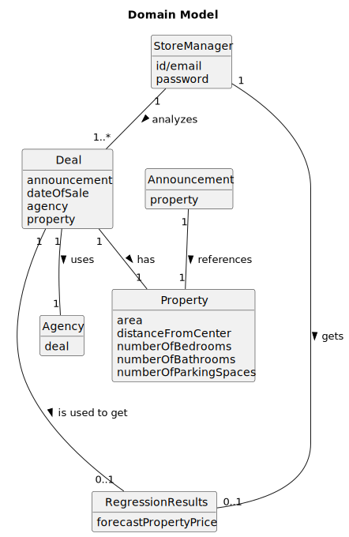

# US18 - To analyze the deals made and  to compare the properties' sale values with the forecast ones.

## 2. Analysis

### 2.1. Relevant Domain Model Excerpt 

### 2.2. Other Remarks

The RegressionReulsts is a class that returns the forecast prices(which is the main functionality of this us)
The return will differ depending on how many an which variables are in use.
