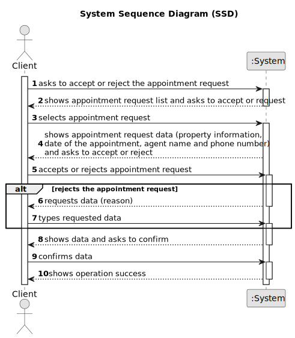

# US 020 - To accept or reject an appointment request.

## 1. Requirements Engineering

### 1.1. User Story Description

As a client, I want to read the response for the appointment request, to accept or reject it.

### 1.2. Customer Specifications and Clarifications 

**From the specifications document:**

>	When the client decides to buy/rent the property, he sends a request for the purchase/lease of the property to the agent. After being appreciated by the agent, he accepts or rejects the order. If the request is accepted, the offer will not be shown again to clients using the application.

**From the client clarifications:**

### 1.3. Acceptance Criteria

* **AC1:** The agent must be notified when the message is displayed to the client. 
* **AC2:** The appointment request must provide information about the property and the date of the appointment. 
* **AC3:** When the appointment is rejected, the client must specify the reason.
* **AC4:** The appointment request must provide the agent name and phone number

### 1.4. Found out Dependencies

* There is a dependency to "US016 To respond that scheduled the visit" since the appointment request is created in this User Story to send to the Client's email and in the application.

### 1.5 Input and Output Data

**Input Data:**

* Typed data:
	* a reason
	
* Selected data:
	* appointment request

**Output Data:**

* (In)Success of the operation

### 1.6. System Sequence Diagram (SSD)

### 1.7 Other Relevant Remarks

n/a