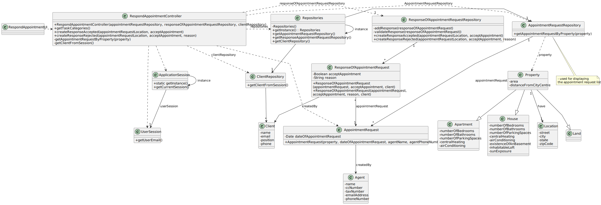

# US 020 - To accept or reject a appointment request 

## 3. Design - User Story Realization 

### 3.1. Rationale

**SSD - Alternative 1 is adopted.**

| Interaction ID | Question: Which class is responsible for...          | Answer                                 | Justification (with patterns)                                                                                 |
|:---------------|:-----------------------------------------------------|:---------------------------------------|:--------------------------------------------------------------------------------------------------------------|
| Step 1  		     | 	... interacting with the actor?                     | RespondAppointmentUI                   | Pure Fabrication: there is no reason to assign this responsibility to any existing class in the Domain Model. |
| 			  		        | 	... coordinating the US?                            | RespondAppointmentController           | Controller                                                                                                    |
| 			  		        | 	... instantiating a new Response?                   | ResponseOfAppointmentRequestRepository | Creator (Rule 1): in the DM this Repository has a response of appointment request.                            |
| 			  		        | ... knowing the user using the system?               | UserSession                            | IE: cf. A&A component documentation.                                                                          |
| 			  		        | 							                                              | ClientRepository                       | IE:has its own Clients                                                                                        |
| 			  		        | 							                                              | Client                                 | IE: knows its own data (e.g. email)                                                                           |
| Step 2  		     | 	...knowing the appointment requests to show?						  | AppointmentRequestRepository           | IE: Appointment Requests are created by the agents and saved in this repository                               |
| Step 3  		     | 	...saving the selected appointment request?         | ResponseOfAppointmentRequest           | IE: object created in step 1 is inserted in one appointment request                                           |
| Step 4  		     | 	                                                    |                                        |                                                                                                               |
| Step 5         | ...saving the inputted/selected data?                | ResponseOfAppointmentRequest           | IE: object created in step 1 knows its data                                                                   |
|                | Alternative (Client rejects the Appointment Request) |                                        |                                                                                                               |
| Step 6  		     | 							                                              |                                        |                                                                                                               |              
| Step 8         | ...saving the inputted data?                         | ResponseOfAppointmentRequest           | IE: object created in step 1 knows its data                                                                   |
| Step 9  		     | 	... validating all data (local validation)?         | ResponseOfAppointmentRequest           | IE: owns its data.                                                                                            | 
| 			  		        | 	... validating all data (global validation)?        | ResponseOfAppointmentRequestRepository | IE: knows all its responses.                                                                                  | 
| 			  		        | 	... saving the created task?                        | ResponseOfAppointmentRequestRepository | IE: owns all its responses.                                                                                   | 
| Step 8  		     | 	... informing operation success?                    | RespondAppointmentUI                   | IE: is responsible for user interactions.                                                                     | 

### Systematization ##

According to the taken rationale, the conceptual classes promoted to software classes are: 

 * ResponseAppointmentRequestRepository
 * ResponseAppointmentRequest

Other software classes (i.e. Pure Fabrication) identified: 

 * RespondAppointmentUI  
 * RespondAppointmentController

## 3.2. Sequence Diagram (SD)

### Alternative 1 - Full Diagram

### Alternative 2 - Split Diagram

**Get Appointment Request List Partial SD**

**Get Appointment Request**

**Get Client**

**Create Response Of Appointment Request**

## 3.3. Class Diagram (CD)

